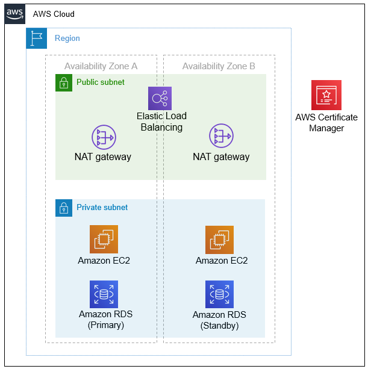

## 作成するAWSリソース


参考文献
- [AWS ソリューション構成例 - 動的 Web サイト](https://aws.amazon.com/jp/cdp/midscale-webservice/)


## ディレクトリ構成
```console
.
├── .github
│   ├── ISSUE_TEMPLATE # Issueテンプレート
│   │   └── 機能追加.md
│   ├── PULL_REQUEST_TEMPLATE.md # PullRequestテンプレート
│   └── workflows
│       ├── dev_linter.yml # dev環境に対して、Linterをかける
│       ├── dev_plan.yml # dev環境にPlanを実行するCI
│       ├── dev_tfsec.yml # dev環境にtfsecを実行するCI
│       ├── envs_apply.yml # 環境を選択してAWSリソースを作成するCI
│       ├── prepare_apply.yml # prepareのAWSリソースを作成するCI
│       └── preprare_plan.yml # prepareにPlanを実行するCI
├── .gitignore # githubに表示しないファイルを設定
├── envs # 環境
│   └── dev # 開発環境
│       ├── .tfsec # tfsec
│       │   └── config.yml # tfsecで無視するセキュリティ
│       ├── backend.tf # tfstateを管理
│       ├── locals.tf dev環境内の環境変数
│       ├── main.tf # devで使用するAWSのリソースを構築
│       ├── provider.tf # terraformの設定
│       └── variables.tf # dev環境で使用するvariable一覧 Actionsから変数を使用
├── modules # 呼び出すリソースを作成
│   ├── dev_tfstate # dev環境でtfstateを管理するリソース
│   │   ├── main.tf # dev環境でtfstateを作成するのに必要なAWSリソース
│   │   ├── outputs.tf # 外部から呼び出す時に使用
│   │   └── variables.tf # ディレクトリ内で使用するvariables一覧
│   ├── network # networkを管理するディレクトリ
│   │   ├── main.tf # network環境を作成するのに必要なAWSリソース
│   │   ├── outputs.tf # 外部から呼び出す時に使用
│   │   └── variables.tf # ディレクトリ内で使用するvariable一覧
│   ├── oidc # OIDC周りのリソース
│   │   ├── main.tf # OIDCを作成するのに必要なAWSリソース
│   │   ├── outputs.tf # 外部から呼び出す時に使用
│   │   └── variables.tf # ディレクトリ内で使用するvariables一覧
│   └── prepare_tfstate
│       ├── main.tf # prepareでtfstateを作成するのに必要なAWSリソース
│       ├── outputs.tf # 外部から呼び出す時に使用
│       └── variables.tf # ディレクトリ内で使用するvariables一覧
├── prepare # 共通リソースを作成 環境によらず作成するリソース
│   ├── backend.tf # tfstateを管理
│   ├── main.tf #  # 共通リソースで使用するAWSのリソースを構築
│   ├── provider.tf # terraformの設定
│   └── variables.tf # 共通環境で使用するvariable一覧
└── readme.md # ディレクトリ内の説明
```

## 実装方法
- state管理は、ベストプラクティスよりDynamoDBとS3で管理 StateLockをかけるため
- CIツールには、tfcmt・tfsec・tflint・Plan・Applyを作成
  - tfcmt : Planでの差分をプルリク内から確認できるようにするツール
  - tfsec : terraformで作成したAWSのリソースをAWSのベストプラクティスの観点からセキュリティ面を診断するツール
  - tflint : terraformのLinter
  - Plan : pushされたコードに対して、作成したリソースがPlanにより、作成できるか検証する
  - Apply : 手動で実行する。リソースを作成するときはローカルで実行せず、ActionsのCIを回して作成する
  - OIDC : AWSの認証をするときはOIDCを使う
- moduleは公式のregistryを採用する
- 公式のregistryを参照しても実装ができない場合、自作のmoduleを作成する
- terraformはterraformのベストプラクティスに沿ったコードを記述していく
- AWSのリソースもまた、AWSのベストプラクティスに沿ったリソース作成をする
- terraformのmoduleは「[standard module structure](https://developer.hashicorp.com/terraform/language/modules/develop/structure)」に従う
  - main.tf, variables.tf, outputs.tf, locals.tfは空でも作成する
  - readmeで各のmodule内で作成されるリソースとリソースの用途を明記
  - variable, outputにはdescriptionとtypeを追加する

## tfsec
terraformで作成したリソースを、AWSのベストプラクティスの観点からセキュリティを分析するツール https://github.com/aquasecurity/tfsec
- .github/workflows/tfsec.ymlの「Show Result tfsec」でtfsecの内容を確認できる。

## 参考ベストプラクティス
[20 Terraform Best Practices to Improve your TF workflow](https://spacelift.io/blog/terraform-best-practices)
